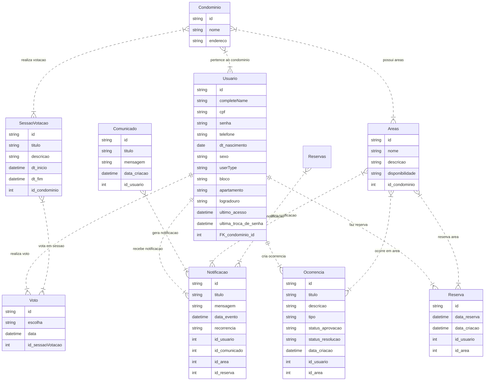
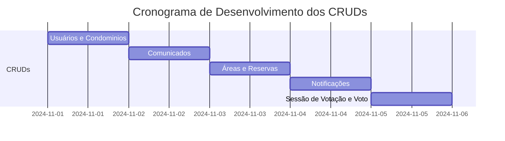

# API ARGUS: Gerenciamento de Condomínios
---

Este repositório contém o código fonte da API RESTful para o backend da aplicação ARGUS, um sistema de gerenciamento de condomínios desenvolvido como projeto de conclusão de curso do programa START.

### Funcionalidades:

- Gerenciamento de Usuários: Cadastro, autenticação, atualização de dados, gerenciamento de permissões
- Gerenciamento de Condomínios: Cadastro, atualização, exclusão de dados
- Comunicação: Envio de comunicados, gerenciamento de mensagens, notificações
- Reservas: Realização de reservas de espaços comuns, aprovação e controle de reservas
- Ocorrências: Registro de ocorrências no condomínio, acompanhamento de status
- Votações: Criação de sessões de votação, registro de votos, visualização de resultados
- Gerenciamento de Áreas Comuns: Cadastro, atualização e exclusão de áreas comuns.

### Tecnologias:

- Spring Boot: Framework Java para desenvolvimento de aplicações web.

- Spring Data JPA: Framework para acesso a bancos de dados relacionais.

- Spring Security: Framework para segurança de aplicações web.

- JWT (JSON Web Token): Protocolo para autenticação e autorização

- AMQP (Advanced Message Queuing Protocol): Protocolo para comunicação assíncrona, com suporte a RabbitMQ.

- Java 17: Linguagem de programação Java, versão 17.

- Docker: O Docker é uma plataforma de software que permite aos desenvolvedores criar, testar e implantar aplicações de forma rápida e eficiente. Em termos simples, ele oferece um ambiente isolado e consistente para suas aplicações, garantindo que elas funcionem da mesma forma em qualquer lugar, seja no seu computador, em um servidor ou na nuvem.

- Junit: O JUnit é um framework de testes para a linguagem de programação Java. Ele é usado para escrever e executar testes automatizados para garantir a qualidade do código. Pense nele como um conjunto de ferramentas que ajudam você a verificar se seu código está funcionando como esperado.

## Modelagem de dados 



## Documentação:

A documentação completa da API está disponível no nosso Notion, com descrições mais detalhadas sobre o nosso processo, desde a ideação até o desenvolvimento: [Notion da ARGUS](https://www.notion.so/ARGUS-Memorial-de-Desenvolvimento-1135144534ed804b81bcf1912b0613e7?pvs=4)

### Sobre o Cronograma e a arquitetura

Atualmente estamos trabalhando com o seguinte cronograma:



Esse cronograma pode sofrer alterações, seja por conta de atrasos ou por conta da necessidade da adição de novas funcionalidades.

Para ter uma visão mais clara da arquitetura do projeto, acesse esse diagrama: [ARQUITETURA](./docs/Arquitetura.md)

## Como Executar:

### Como instalar o Java Development Kit

1. Acesse a página do download:

    [DONWLOAD O JDK17](https://download.oracle.com/java/17/archive/jdk-17.0.12_windows-x64_bin.exe)

    Esse arquivo já é um instalador padrão para o Windows, então é só seguir com o passo a passo da instalação.

### Como instalar o Apache Maven

1. Baixe o arquivo compactado do Maven

    É só acessar esse link aqui: [DOWNLOAD DO .zip DO MAVEN](https://dlcdn.apache.org/maven/maven-3/3.9.9/binaries/apache-maven-3.9.9-bin.zip)

2. Escolha uma pasta onde descompactar o arquivo .zip

    Pode ser qualquer pasta, mas é bom ter um local adequado, eu recomendo deixar dentro da pasta de arquivos de programas do seu computador (C:\Program Files\Maven\apache-maven-3.9.9)

3. Acrescentando o Maven nas variáveis de ambiente do sistema

    Vá no seu menu iniciar e pesquise por "Sistema", dentro das configurações do sistema procure pela opção "Configurações avançadas do sistema". Uma nova janela se abrirá e nela você deve procurar pela opção "Variáveis de ambiente", uma nova janela deverá se abrir.

    Na seção inferior da nova janela ficarão as variáveis de ambiente para o seu computador, parte de cima ficam as variáveis somente para o seu usuário atual, você deve procurar pela variável "Path" e editá-la. No menu de edição, selecione "Novo" e cole o endereço até a pasta "bin" do Maven. Para mim ficou dessa forma "C:\Program Files\Maven\apache-maven-3.9.9\bin".

    Depois disso teste a instalação usando o comando a seguir no terminal:

    ```
    mvn -v
    ```

### Clone este repositório:

1. Escolha uma pasta para armazenar o projeto e use esse comando, caso você já possua o git instalado:

```
git clone https://github.com/ProjetoARGUS/ArgusAPI.git
```

2. Acesse o diretório do projeto:

```
cd ArgusAPI
```


3. Execute o comando a seguir para testar se está tudo certo com a aplicação:

```
mvn test
```

4. Execute este comando para rodar o projeto:

```
mvn spring-boot:run
```
---

## Como Contribuir

Agradecemos o seu interesse em contribuir com o projeto ARGUS! Se você deseja participar do desenvolvimento, siga os passos abaixo:

1. Fork do Projeto:

   Acesse o repositório do projeto no GitHub: [API-PROEJTO-ARGUS](https://github.com/ProjetoARGUS/ArgusAPI/).

   Clique no botão "Fork" no canto superior direito da página.
   Agora você possui uma cópia do repositório em sua própria conta do GitHub.

2. Para fazer o clone do Projeto abra seu terminal e execute o comando:

```
git clone https://github.com/ProjetoARGUS/ArgusAPI.git
```

Isso criará uma cópia local do projeto em seu computador.

3. Faça o Commit de Mudanças:

   Edite os arquivos do projeto e faça as suas alterações.

   Adicione as alterações ao staging area:

```
git add [nome dos arquivos alterados]
```

Ou então faça dessa forma para colocar todo os arquivos modificados na sessão de staged:

```
git add .
```

Faça um commit das alterações:

```
git commit -m "[descrição concisa das suas alterações]"
```

4. Crie um Pull Request:

   Acesse o repositório do projeto em sua própria conta do GitHub.

   Vá até a branch onde você fez as alterações.

   Clique no botão "New pull request".

   Compare sua branch com a branch "main" do repositório original.

   Insira uma descrição detalhada de suas alterações no pull request.

   Clique em "Create pull request".

### Observações:

1. Revise seu código antes de enviar um pull request: Verifique se as alterações estão funcionando corretamente e se seguem os padrões de codificação do projeto.
2. Siga as diretrizes de contribuição: Se houver diretrizes específicas para o projeto, siga-as cuidadosamente.
3. Seja paciente: O processo de revisão de pull requests pode levar algum tempo.

*Agradecemos a sua contribuição!* 🎉

-----

## Licença:

[GNU General Public License v3.0](./LICENSE.md)

Equipe de Desenvolvimento:

- Ailton Francisco da Silva Neto
- Breno do nascimento santos
- Derick Germano de Oliveira
- Francisco Macedo de Santiago Neto
- Luan carlos wanderley da silva
- Ronaldo Rodrigues de Moura Júnior

---

## Agradecimentos:

Agradecemos ao programa START pela oportunidade de desenvolver este projeto.
