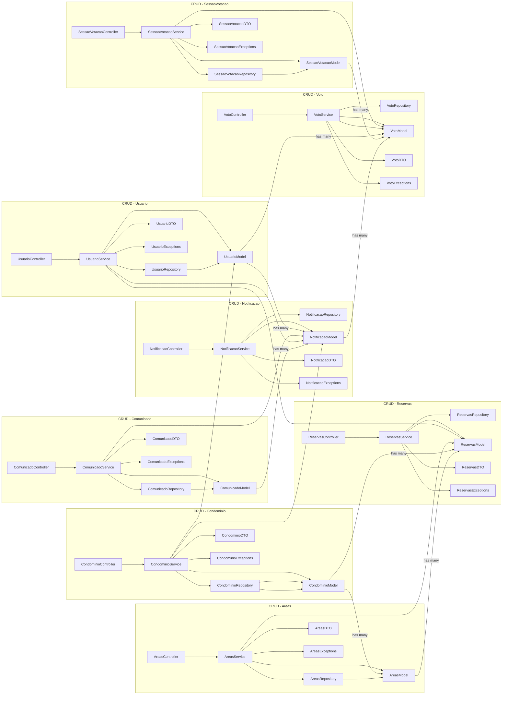

```mermaid
graph LR
  subgraph CRUD - Condominio
    A[CondominioController] --> B[CondominioService]
    B --> C[CondominioRepository]
    B --> D[CondominioModel]
    B --> E[CondominioDTO]
    B --> F[CondominioExceptions]
  end

  subgraph CRUD - Usuario
    G[UsuarioController] --> H[UsuarioService]
    H --> I[UsuarioRepository]
    H --> J[UsuarioModel]
    H --> K[UsuarioDTO]
    H --> L[UsuarioExceptions]
  end

  subgraph CRUD - Comunicado
    M[ComunicadoController] --> N[ComunicadoService]
    N --> O[ComunicadoRepository]
    N --> P[ComunicadoModel]
    N --> Q[ComunicadoDTO]
    N --> R[ComunicadoExceptions]
  end

  subgraph CRUD - Notificacao
    S[NotificacaoController] --> T[NotificacaoService]
    T --> U[NotificacaoRepository]
    T --> V[NotificacaoModel]
    T --> W[NotificacaoDTO]
    T --> X[NotificacaoExceptions]
  end

  subgraph CRUD - Areas
    Y[AreasController] --> Z[AreasService]
    Z --> AA[AreasRepository]
    Z --> AB[AreasModel]
    Z --> AC[AreasDTO]
    Z --> AD[AreasExceptions]
  end

  subgraph CRUD - Reservas
    AE[ReservasController] --> AF[ReservasService]
    AF --> AG[ReservasRepository]
    AF --> AH[ReservasModel]
    AF --> AI[ReservasDTO]
    AF --> AJ[ReservasExceptions]
  end

  subgraph CRUD - SessaoVotacao
    AK[SessaoVotacaoController] --> AL[SessaoVotacaoService]
    AL --> AM[SessaoVotacaoRepository]
    AL --> AN[SessaoVotacaoModel]
    AL --> AO[SessaoVotacaoDTO]
    AL --> AP[SessaoVotacaoExceptions]
  end

  subgraph CRUD - Voto
    AQ[VotoController] --> AR[VotoService]
    AR --> AS[VotoRepository]
    AR --> AT[VotoModel]
    AR --> AU[VotoDTO]
    AR --> AV[VotoExceptions]
  end

  B --> J -- "has many" --> V
  N --> V
  H --> V
  H --> AH
  Z --> AH
  AL --> AT
  AR --> AT
  C --> D -- "has many" --> AB
  C --> D -- "has many" --> AH
  I --> J -- "has many" --> AT
  O --> P -- "has many" --> V
  AA --> AB -- "has many" --> AH
  AM --> AN -- "has many" --> AT
  B --> V -- "has many" --> AT
```